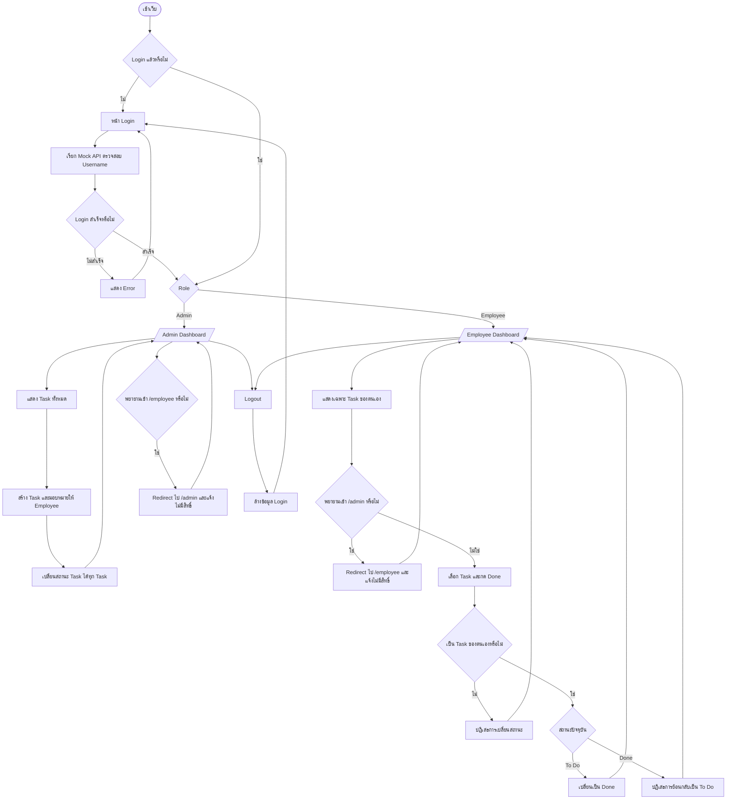

```mermaid
flowchart TD
    A([เข้าเว็บ]) --> B{Login แล้วหรือไม่}

    B -- ไม่ --> L[หน้า Login]
    L --> V[เรียก Mock API ตรวจสอบ Username]
    V --> C{Login สำเร็จหรือไม่}
    C -- ไม่สำเร็จ --> LE[แสดง Error]
    LE --> L
    C -- สำเร็จ --> R{Role}

    B -- ใช่ --> R

    R -- Admin --> AD[/Admin Dashboard/]
    R -- Employee --> EM[/Employee Dashboard/]

    AD --> A1[แสดง Task ทั้งหมด]
    A1 --> A2[สร้าง Task และมอบหมายให้ Employee]
    A2 --> A3[เปลี่ยนสถานะ Task ได้ทุก Task]
    A3 --> AD

    EM --> E1[แสดงเฉพาะ Task ของตนเอง]
    E1 --> E2{พยายามเข้า /admin หรือไม่}
    E2 -- ใช่ --> G1[Redirect ไป /employee และแจ้งไม่มีสิทธิ์]
    G1 --> EM
    E2 -- ไม่ใช่ --> E3[เลือก Task และกด Done]

    E3 --> O{เป็น Task ของตนเองหรือไม่}
    O -- ไม่ --> OE[ปฏิเสธการเปลี่ยนสถานะ]
    OE --> EM

    O -- ใช่ --> S{สถานะปัจจุบัน}
    S -- To Do --> OK[เปลี่ยนเป็น Done]
    OK --> EM
    S -- Done --> RV[ปฏิเสธการย้อนกลับเป็น To Do]
    RV --> EM

    AD --> G2{พยายามเข้า /employee หรือไม่}
    G2 -- ใช่ --> G3[Redirect ไป /admin และแจ้งไม่มีสิทธิ์]
    G3 --> AD

    AD --> LO[Logout]
    EM --> LO
    LO --> CL[ล้างข้อมูล Login]
    CL --> L
```